# Authentication Flow Diagram - 10xCards

This diagram visualizes the complete authentication architecture for the 10xCards application, including user registration, email verification, login, password reset, and logout flows.

## Architecture Analysis

Based on the authentication specification and PRD, the key components involved in the authentication process are:

**Django-allauth Views and URLs (all under `/accounts/`):**
1. Signup View (`/accounts/signup/`) - Registration form and processing
2. Login View (`/accounts/login/`) - Login form and authentication
3. Logout View (`/accounts/logout/`) - Session termination
4. Email Confirmation Pending (`/accounts/confirm-email/`) - Verification pending page
5. Email Confirmation (`/accounts/confirm-email/<key>/`) - Token validation
6. Password Reset Request (`/accounts/password/reset/`) - Reset request form
7. Password Reset Email Sent (`/accounts/password/reset/done/`) - Confirmation page
8. Password Reset Confirmation (`/accounts/password/reset/key/<uidb36>-<key>/`) - New password form

**Custom User Components:**
1. UserRedirectView (`/users/~redirect/`) - Post-login redirect handler
2. UserDetailView (`/users/<pk>/`) - User profile (not linked in MVP nav)
3. UserUpdateView (`/users/~update/`) - Profile editing (not linked in MVP nav)
4. AccountAdapter - Controls registration availability
5. SocialAccountAdapter - Social auth adapter

**Models:**
1. User (flashcards.users.User) - Custom email-based user model
2. EmailAddress (allauth) - Email verification tracking
3. EmailConfirmation (allauth) - Verification tokens

**Templates & Layouts:**
1. entrance.html - Layout for auth pages (signup, login, password reset)
2. manage.html - Layout for account management
3. base.html - Main layout with navigation bar

**Integration Points:**
1. Navigation bar - Conditional rendering based on auth state
2. Flashcard views - All require LoginRequiredMixin
3. CSRF protection - Applied to all forms
4. Email system - Verification and password reset

**Data Flow:**
1. Registration → Email Verification → Login → Flashcard Access
2. Password Reset Request → Email → Reset Confirmation → Login
3. Login → UserRedirectView → My Flashcards
4. Logout → Login Page

## Diagram

```mermaid
flowchart TD
    subgraph "Punkty Wejścia Użytkownika"
        START_NEW["Nowy Użytkownik"]
        START_EXISTING["Istniejący Użytkownik"]
        START_FORGOT["Zapomniał Hasła"]
    end

    subgraph "Moduł Rejestracji"
        SIGNUP_PAGE["Strona Rejestracji<br/>/accounts/signup/"]
        SIGNUP_FORM["Formularz: email, hasło, potwierdzenie"]
        SIGNUP_VALIDATE["Walidacja Danych<br/>- Format email<br/>- Siła hasła<br/>- Unikalność email"]
        SIGNUP_CREATE["Utworzenie Użytkownika<br/>- Hashowanie hasła Argon2<br/>- Tworzenie EmailAddress<br/>- Status: niezweryfikowany"]
        SIGNUP_EMAIL["Wysłanie Email Weryfikacyjnego<br/>- Token UUID<br/>- Ważność: 3 dni"]
        SIGNUP_PENDING["Strona Oczekiwania<br/>/accounts/confirm-email/"]
    end

    subgraph "Moduł Weryfikacji Email"
        EMAIL_LINK["Link w Email<br/>confirm-email/key/"]
        EMAIL_VALIDATE["Walidacja Tokenu<br/>- Sprawdzenie wygaśnięcia<br/>- Weryfikacja klucza"]
        EMAIL_CONFIRM["Oznaczenie jako Zweryfikowany<br/>EmailAddress.verified = True"]
        EMAIL_SUCCESS["Strona Sukcesu<br/>Przekierowanie do logowania"]
        EMAIL_ERROR["Błąd: Token Wygasł/Nieprawidłowy"]
        EMAIL_RESEND["Możliwość Ponownego<br/>Wysłania Email"]
    end

    subgraph "Moduł Logowania"
        LOGIN_PAGE["Strona Logowania<br/>/accounts/login/"]
        LOGIN_FORM["Formularz: email, hasło"]
        LOGIN_AUTH["Autentykacja<br/>- Weryfikacja hasła Argon2<br/>- Sprawdzenie is_active<br/>- Wymóg weryfikacji email"]
        LOGIN_SESSION["Utworzenie Sesji Django<br/>- Session cookie httponly<br/>- CSRF token<br/>- Ważność: 2 tygodnie"]
        LOGIN_REDIRECT["UserRedirectView<br/>/users/~redirect/"]
        LOGIN_DESTINATION["Moje Fiszki<br/>/flashcards/"]
        LOGIN_ERROR["Błąd Logowania<br/>- Nieprawidłowe dane<br/>- Email niezweryfikowany"]
    end

    subgraph "Moduł Resetowania Hasła"
        RESET_REQUEST_PAGE["Strona Żądania Resetu<br/>/accounts/password/reset/"]
        RESET_REQUEST_FORM["Formularz: email"]
        RESET_SEND_EMAIL["Wysłanie Email Resetującego<br/>- Token HMAC-SHA256<br/>- UID base36<br/>- Ważność: 3 dni"]
        RESET_SENT_PAGE["Potwierdzenie Wysłania<br/>/accounts/password/reset/done/"]
        RESET_EMAIL_LINK["Link w Email<br/>reset/key/uid-key/"]
        RESET_VALIDATE_TOKEN["Walidacja Tokenu<br/>- Sprawdzenie wygaśnięcia<br/>- Weryfikacja hash"]
        RESET_CONFIRM_PAGE["Formularz Nowego Hasła<br/>password/reset/key/..."]
        RESET_SET_PASSWORD["Ustawienie Nowego Hasła<br/>- Walidacja siły hasła<br/>- Hashowanie Argon2<br/>- Unieważnienie sesji"]
        RESET_SUCCESS["Sukces<br/>Przekierowanie do logowania"]
        RESET_ERROR["Błąd: Token Wygasł"]
    end

    subgraph "Moduł Wylogowania"
        LOGOUT_LINK["Link Wylogowania<br/>w Nawigacji"]
        LOGOUT_POST["POST /accounts/logout/<br/>z CSRF token"]
        LOGOUT_DESTROY["Zniszczenie Sesji<br/>- Usunięcie session cookie<br/>- Czyszczenie danych"]
        LOGOUT_REDIRECT["Przekierowanie<br/>do strony logowania"]
    end

    subgraph "Komponenty Bezpieczeństwa"
        CSRF["Ochrona CSRF<br/>- Token w formularzach<br/>- Walidacja middleware"]
        SESSION["Zarządzanie Sesją<br/>- Baza danych<br/>- HTTPOnly cookies<br/>- Secure w produkcji"]
        PASSWORD["Hashowanie Hasła<br/>- Argon2 (primary)<br/>- Memory-hard<br/>- Auto-rehash"]
    end

    subgraph "Adaptery i Middleware"
        ACCOUNT_ADAPTER["AccountAdapter<br/>- Kontrola rejestracji<br/>- ALLOW_REGISTRATION"]
        AUTH_MIDDLEWARE["AuthenticationMiddleware<br/>- Populacja request.user<br/>- Walidacja sesji"]
    end

    subgraph "Nawigacja i UI"
        NAV_UNAUTH["Pasek Nawigacji<br/>Niezalogowany:<br/>- Sign Up<br/>- Sign In"]
        NAV_AUTH["Pasek Nawigacji<br/>Zalogowany:<br/>- My Flashcards<br/>- Generate Flashcards<br/>- Create Flashcard<br/>- Sign Out"]
        LAYOUT_ENTRANCE["Layout: entrance.html<br/>- Wyśrodkowany formularz<br/>- Bootstrap 5 card<br/>- Minimalne rozproszenia"]
        LAYOUT_BASE["Layout: base.html<br/>- Pełna nawigacja<br/>- Obszar komunikatów<br/>- Responsywny grid"]
    end

    subgraph "Model Danych"
        USER_MODEL["User Model<br/>- email unique USERNAME_FIELD<br/>- password hashed<br/>- is_active, is_staff<br/>- date_joined, last_login"]
        EMAIL_MODEL["EmailAddress Model<br/>- user ForeignKey<br/>- verified BooleanField<br/>- primary BooleanField"]
        EMAIL_CONF_MODEL["EmailConfirmation Model<br/>- email_address ForeignKey<br/>- key CharField UUID<br/>- created DateTimeField"]
    end

    subgraph "Chronione Zasoby"
        FLASHCARD_LIST["FlashcardListView<br/>LoginRequiredMixin"]
        GENERATE_INPUT["GenerateFlashcardsInputView<br/>LoginRequiredMixin"]
        FLASHCARD_DELETE["FlashcardDeleteView<br/>LoginRequiredMixin"]
        USER_DETAIL["UserDetailView<br/>LoginRequiredMixin"]
    end

    %% Przepływ Rejestracji
    START_NEW --> SIGNUP_PAGE
    SIGNUP_PAGE --> SIGNUP_FORM
    SIGNUP_FORM --> SIGNUP_VALIDATE
    SIGNUP_VALIDATE -->|Błędy walidacji| SIGNUP_FORM
    SIGNUP_VALIDATE -->|Dane prawidłowe| SIGNUP_CREATE
    SIGNUP_CREATE --> USER_MODEL
    SIGNUP_CREATE --> EMAIL_MODEL
    SIGNUP_CREATE --> SIGNUP_EMAIL
    SIGNUP_EMAIL --> EMAIL_CONF_MODEL
    SIGNUP_EMAIL --> SIGNUP_PENDING
    SIGNUP_PENDING --> EMAIL_RESEND

    %% Przepływ Weryfikacji Email
    SIGNUP_EMAIL -.Email.-> EMAIL_LINK
    EMAIL_RESEND -.Email.-> EMAIL_LINK
    EMAIL_LINK --> EMAIL_VALIDATE
    EMAIL_VALIDATE -->|Token prawidłowy| EMAIL_CONFIRM
    EMAIL_VALIDATE -->|Token nieprawidłowy| EMAIL_ERROR
    EMAIL_CONFIRM --> EMAIL_MODEL
    EMAIL_CONFIRM --> EMAIL_SUCCESS
    EMAIL_ERROR --> EMAIL_RESEND
    EMAIL_SUCCESS --> LOGIN_PAGE

    %% Przepływ Logowania
    START_EXISTING --> LOGIN_PAGE
    EMAIL_SUCCESS --> LOGIN_PAGE
    LOGIN_PAGE --> LOGIN_FORM
    LOGIN_FORM --> LOGIN_AUTH
    LOGIN_AUTH --> PASSWORD
    LOGIN_AUTH -->|Email niezweryfikowany| LOGIN_ERROR
    LOGIN_AUTH -->|Dane nieprawidłowe| LOGIN_ERROR
    LOGIN_ERROR --> LOGIN_FORM
    LOGIN_AUTH -->|Sukces| LOGIN_SESSION
    LOGIN_SESSION --> SESSION
    LOGIN_SESSION --> LOGIN_REDIRECT
    LOGIN_REDIRECT --> LOGIN_DESTINATION
    LOGIN_DESTINATION --> NAV_AUTH

    %% Przepływ Resetowania Hasła
    START_FORGOT --> RESET_REQUEST_PAGE
    LOGIN_PAGE --> RESET_REQUEST_PAGE
    RESET_REQUEST_PAGE --> RESET_REQUEST_FORM
    RESET_REQUEST_FORM --> RESET_SEND_EMAIL
    RESET_SEND_EMAIL --> RESET_SENT_PAGE
    RESET_SEND_EMAIL -.Email.-> RESET_EMAIL_LINK
    RESET_EMAIL_LINK --> RESET_VALIDATE_TOKEN
    RESET_VALIDATE_TOKEN -->|Token prawidłowy| RESET_CONFIRM_PAGE
    RESET_VALIDATE_TOKEN -->|Token wygasł| RESET_ERROR
    RESET_ERROR --> RESET_REQUEST_PAGE
    RESET_CONFIRM_PAGE --> RESET_SET_PASSWORD
    RESET_SET_PASSWORD --> PASSWORD
    RESET_SET_PASSWORD --> USER_MODEL
    RESET_SET_PASSWORD --> RESET_SUCCESS
    RESET_SUCCESS --> LOGIN_PAGE

    %% Przepływ Wylogowania
    NAV_AUTH --> LOGOUT_LINK
    LOGOUT_LINK --> LOGOUT_POST
    LOGOUT_POST --> CSRF
    LOGOUT_POST --> LOGOUT_DESTROY
    LOGOUT_DESTROY --> SESSION
    LOGOUT_DESTROY --> LOGOUT_REDIRECT
    LOGOUT_REDIRECT --> NAV_UNAUTH

    %% Ochrona Zasobów
    LOGIN_DESTINATION --> FLASHCARD_LIST
    NAV_AUTH --> FLASHCARD_LIST
    NAV_AUTH --> GENERATE_INPUT
    NAV_AUTH --> USER_DETAIL
    FLASHCARD_LIST --> AUTH_MIDDLEWARE
    GENERATE_INPUT --> AUTH_MIDDLEWARE
    FLASHCARD_DELETE --> AUTH_MIDDLEWARE
    USER_DETAIL --> AUTH_MIDDLEWARE

    %% Integracje Bezpieczeństwa
    SIGNUP_FORM --> CSRF
    LOGIN_FORM --> CSRF
    RESET_REQUEST_FORM --> CSRF
    RESET_CONFIRM_PAGE --> CSRF
    SIGNUP_VALIDATE --> ACCOUNT_ADAPTER

    %% Układ Szablonów
    SIGNUP_PAGE --> LAYOUT_ENTRANCE
    LOGIN_PAGE --> LAYOUT_ENTRANCE
    RESET_REQUEST_PAGE --> LAYOUT_ENTRANCE
    RESET_CONFIRM_PAGE --> LAYOUT_ENTRANCE
    EMAIL_SUCCESS --> LAYOUT_BASE
    FLASHCARD_LIST --> LAYOUT_BASE

    %% Stylizacja węzłów
    classDef entryPoint fill:#e1f5ff,stroke:#01579b,stroke-width:2px
    classDef authFlow fill:#fff3e0,stroke:#e65100,stroke-width:2px
    classDef security fill:#ffebee,stroke:#c62828,stroke-width:2px
    classDef dataModel fill:#f3e5f5,stroke:#4a148c,stroke-width:2px
    classDef protected fill:#e8f5e9,stroke:#2e7d32,stroke-width:2px

    class START_NEW,START_EXISTING,START_FORGOT entryPoint
    class SIGNUP_PAGE,LOGIN_PAGE,RESET_REQUEST_PAGE,EMAIL_LINK authFlow
    class CSRF,SESSION,PASSWORD,AUTH_MIDDLEWARE,ACCOUNT_ADAPTER security
    class USER_MODEL,EMAIL_MODEL,EMAIL_CONF_MODEL dataModel
    class FLASHCARD_LIST,GENERATE_INPUT,FLASHCARD_DELETE,USER_DETAIL protected
```

## Key Flows

### 1. Registration Flow
User signup → Data validation → User creation → Email verification sent → Pending page

### 2. Email Verification Flow
Email link clicked → Token validation → Account marked as verified → Redirect to login

### 3. Login Flow
Email & password submitted → Authentication → Session creation → UserRedirectView → My Flashcards

### 4. Password Reset Flow
Reset request → Email sent → Token link clicked → New password form → Password updated → Login

### 5. Logout Flow
Logout link clicked → POST with CSRF → Session destroyed → Redirect to login page

## Security Features

- **CSRF Protection**: All forms protected with CSRF tokens
- **Session Security**: HTTPOnly, Secure cookies with 2-week expiration
- **Password Hashing**: Argon2 memory-hard algorithm with auto-rehashing
- **Email Verification**: Mandatory verification before account activation
- **Token Security**: Time-limited (3 days), single-use tokens for verification and password reset
- **Authorization**: LoginRequiredMixin on all protected resources
